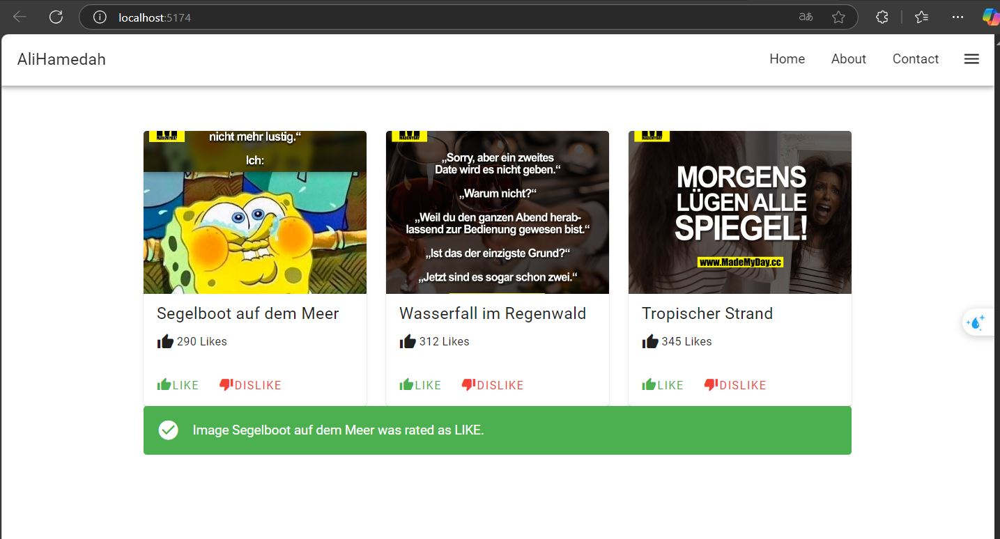

# Image Gallery

Ein einfaches Bildgalerie-Projekt, das es ermöglicht, Bilder anzuzeigen, zu bewerten und zu filtern.

## 📌 Features

- 📷 Bilder anzeigen
- 👍👎 Like/Dislike-Funktionalität
- 📝 Zeigen von Bildbeschreibungen
- 📱 Responsive Design für verschiedene Bildschirmgrößen

## 📥 Installation

1. **Repository klonen:**
   ```bash
   git clone https://github.com/Ali-Hamedah/image-gallery.git
   ```
2. **Zum Projektverzeichnis wechseln:**
   ```bash
   cd image-gallery
   ```
3. **Abhängigkeiten installieren (falls erforderlich):**
   ```bash
   npm install
   npm run dev
   ```

## 🖼 Vorschau

### Beispielbild:


## 🎥 Demo-Video

📹 [Hier klicken, um das Video anzusehen](src/assets/1741380767961.mp4)

---

💡 **Hinweis:** Falls das Video nicht direkt abgespielt wird, kannst du es mit einem externen Player öffnen.
